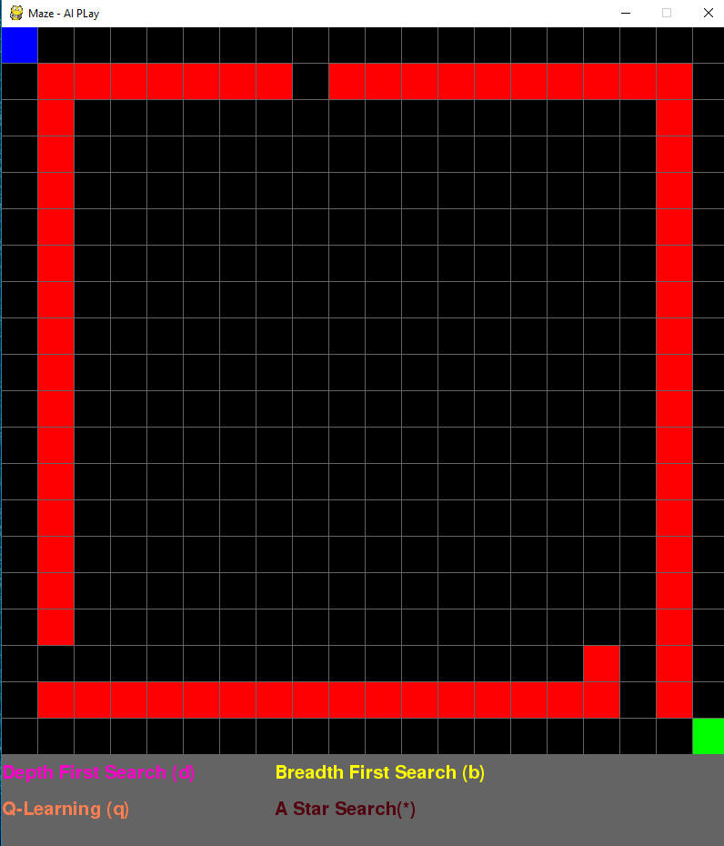
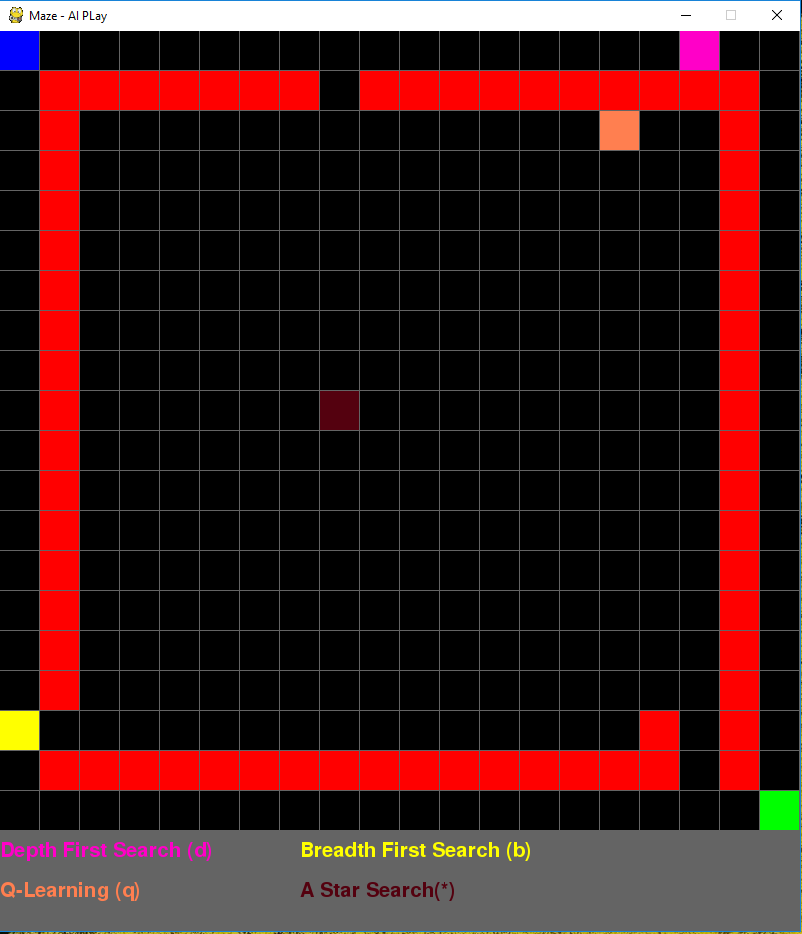

# MAZE

A basic maze implementation in pyGame made for IA algorithms training and testing.

Basic commands:

1. Install Requirements
> pip3 install -U pygame

> pip3 install -U numpy

May require pip3 upgrade:
> python3 -m pip install --upgrade pip

2. Run Game:
> python3 game.py

3. In Game Options:
	+ Arrows to move starting position
	+ Mouse1 to place a wall (Mouse1 over a wall to remove)
	+ Mouse2 to place a target
	+ 'Space' to toggle wall drawing mode
	+ 'd' to perform a depth-first-search
	+ 'b' to perform a bredth-first-search
	+ 's' to perfomr an A* search (using manhattan distance as an heuristic)
	+ 'q' To perform train a Q-Learning model and then apply this model
	+ 'a' to perform all algorithms
	+ 'r' to restart game (keep blocks)
	+ 'R' to restart all
	+ 'g' to auto generate maze (using Prim's algorithm)

4. Images

